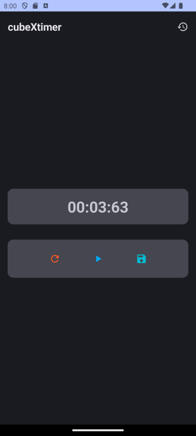
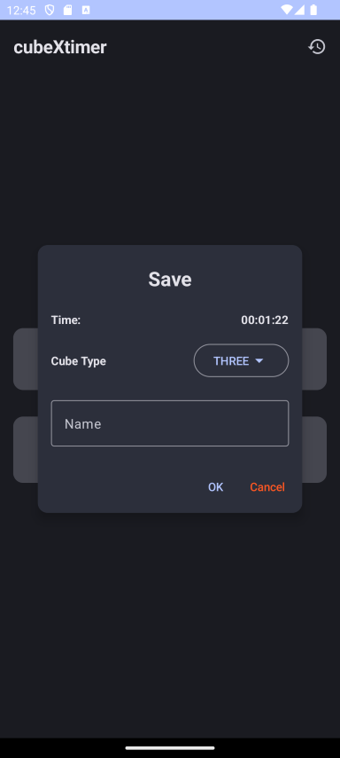
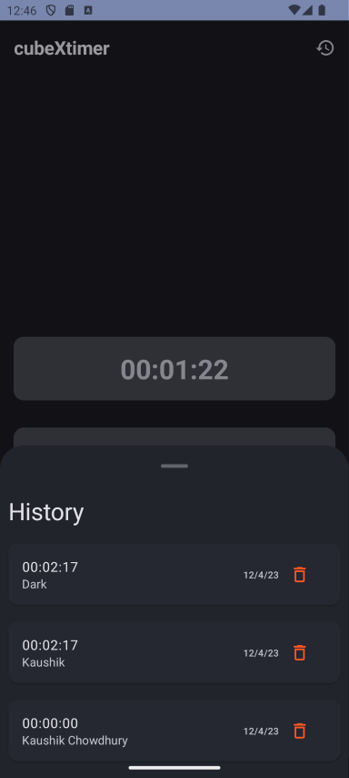

# cubeXtimer kotlin

A simple timer for your everyday cube solving needs.

## Why not stopwatch?

- To time your solves correctly and quickly you need a big touch target which most stopwatches lack.
- You also can save and view your times in a list.

## Screenshots

## Features

- [x] Timer
- [x] List of times
- [x] Delete times
- [x] Save times

## What's Working?

- [x] Timer
- [x] Animation

## What's to be fixed?

- [ ] Implement delete times
- [ ] Make a dialog for delete confirmation
- [ ] Improve Look of history
- [ ] Improve overall look of the app
- [ ] Write some tests for view-models
- [ ] Write a README.md file

## Pre-requisites
- Language: Kotlin
- UI: Jetpack Compose
- Architecture: MVVM (Model-View-ViewModel)
- Database: Room (SQLite)

## How to contribute?

- Fork the repository
- Clone the repository
- Create a new branch
- Make your changes
- Commit your changes
- Push your changes
- Create a pull request
- Wait for the pull request to be reviewed
- Wait for the pull request to be merged
- Celebrate your contribution
- Repeat